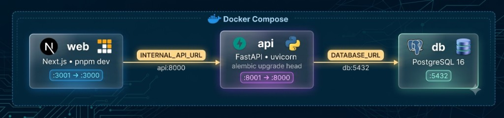
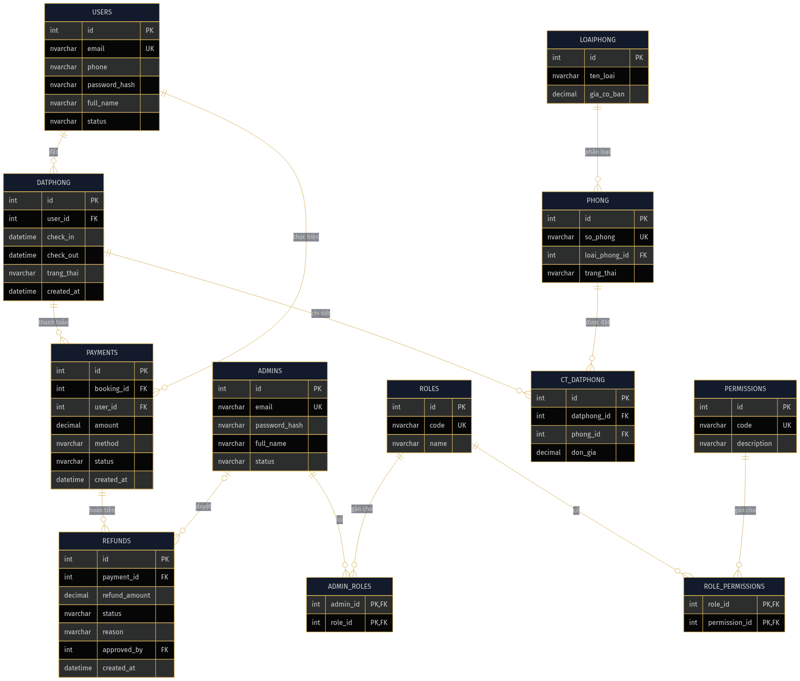

# Chương 1: Thiết kế & triển khai

## 1.1. Kiến trúc tổng thể

Hệ thống được tổ chức thành ba service độc lập, chạy cùng lúc qua Docker Compose: `web`
(Next.js) phục vụ cả trang khách hàng lẫn trang quản trị, `api` (FastAPI) xử lý toàn bộ nghiệp
vụ và truy vấn dữ liệu, và `db` (PostgreSQL 16) lưu trữ dữ liệu. Tách riêng frontend và backend
cho phép hai tầng phát triển độc lập, đồng thời cho phép thử trực tiếp API qua Swagger UI trong
lúc phát triển mà không cần qua giao diện.

## 1.2. Công nghệ sử dụng

Phía backend dùng Python với các thư viện chính sau:

| Thư viện | Mục đích trong đồ án |
|---|---|
| FastAPI | Framework HTTP: định tuyến, dependency injection (`Depends`), CORS, tự sinh đặc tả OpenAPI |
| Swagger UI | Giao diện web để thử trực tiếp từng endpoint ngay trên trình duyệt, đăng nhập (Authorize) bằng token vừa lấy được |
| Uvicorn | ASGI server chạy ứng dụng, tự reload khi code thay đổi trong Docker |
| Poetry | Quản lý dependency và virtualenv qua `pyproject.toml` |
| Pydantic v2 | Validate dữ liệu vào/ra, serialize JSON, khớp đúng hợp đồng OpenAPI |
| pydantic-settings | Đọc cấu hình từ `.env` (CORS, chuỗi kết nối database) |
| SQLAlchemy 2 | ORM ánh xạ model Python sang bảng PostgreSQL, quản lý session theo từng request |
| Alembic | Sinh và áp dụng migration thay đổi schema database |
| psycopg | Driver kết nối PostgreSQL |

: Thư viện backend chính sử dụng trong đồ án

Phía frontend dùng Next.js (App Router) kết hợp Tailwind CSS, dựng chung trong một ứng dụng cho
cả hai vai trò khách hàng và quản trị, tách thành hai khu vực riêng biệt trong ứng dụng - khu
vực dành cho khách và khu vực quản trị - có cơ chế kiểm tra đăng nhập chặn truy cập khi chưa
đăng nhập đúng vai trò.

Về xác thực, hệ thống dùng cơ chế đơn giản phù hợp phạm vi đồ án: mật khẩu được băm trước khi
lưu, và token đăng nhập là chuỗi base64 mã hoá dạng `user:{id}` hoặc `admin:{id}` - không phải
JWT ký số như hệ thống production thực tế. Token không thể thu hồi phía server khi đăng xuất,
client tự xoá token là đủ để coi như đã đăng xuất.

## 1.3. Mô hình dữ liệu (ERD)

Cơ sở dữ liệu PostgreSQL được thiết kế thành ba nhóm bảng chính:

- **Người dùng & phân quyền**: `USERS` (khách hàng) và `ADMINS` (nhân viên/quản trị) là hai
  bảng độc lập, không kế thừa nhau, quyền của admin suy ra qua `ADMIN_ROLES` → `ROLES`, chi
  tiết quyền hạn nằm ở `ROLE_PERMISSIONS` → `PERMISSIONS`.
- **Phòng & đặt phòng**: `LOAIPHONG` (loại phòng) có nhiều `PHONG` (phòng cụ thể), một lượt đặt
  `DATPHONG` gồm nhiều dòng chi tiết `CT_DATPHONG`, mỗi dòng gắn với một `PHONG`.
- **Thanh toán**: mỗi `DATPHONG` có thể có `PAYMENTS` tương ứng, yêu cầu hoàn tiền được lưu ở
  `REFUNDS`, tham chiếu ngược lại `PAYMENTS`.

Luồng dữ liệu chính khi khách đặt phòng: `USERS → DATPHONG → CT_DATPHONG → PHONG`, sau đó
`PAYMENTS → REFUNDS` khi có yêu cầu hủy/hoàn tiền.

## 1.4. Thiết kế API

Quy trình xây dựng API đi theo hướng spec-first: đặc tả OpenAPI (`documents/openapi.yaml`)
được thống nhất trước, sau đó scaffold toàn bộ endpoint trả dữ liệu giả (`stubs.py`) để frontend
có thể phát triển song song, rồi thay dần dữ liệu giả bằng truy vấn PostgreSQL thật.

Toàn bộ endpoint được nhóm theo cụm tính năng - mỗi cụm gồm trọn vẹn cả API phía khách hàng lẫn
API phía quản trị liên quan tới cùng một nghiệp vụ:

- **Xác thực & tài khoản**: đăng ký và đăng nhập khách hàng, đăng nhập quản trị viên, lấy
  thông tin phiên đăng nhập hiện tại. Đây là nền tảng mà các cụm còn lại phụ thuộc vào - mọi
  chức năng khác đều yêu cầu đăng nhập trước khi sử dụng.
- **Loại phòng & phòng**: tìm loại phòng và phòng còn trống theo ngày (phía khách), CRUD loại
  phòng và phòng (phía quản trị).
- **Đặt phòng & thanh toán**: tạo và xem đơn đặt phòng (phía khách), quản lý đơn đặt phòng và
  thanh toán (phía quản trị).
- **Hủy đặt phòng & hoàn tiền**: khách tự hủy đơn đã đặt, quản trị viên duyệt hoặc từ chối yêu
  cầu hoàn tiền.
- **Khách hàng, tài khoản quản trị & dashboard**: quản lý khách hàng (khoá/mở tài khoản), quản
  lý tài khoản và vai trò nhân viên, tổng hợp số liệu cho dashboard KPI.

Cách chia này giúp mỗi cụm tính năng độc lập tương đối với nhau, chỉ chia sẻ chung tầng xác
thực - thuận tiện cho việc phát triển song song và kiểm thử từng cụm riêng biệt qua Swagger UI
trước khi nối vào giao diện.

## 1.5. Công cụ hỗ trợ phát triển: 4 skill Claude Code

Để giữ đúng quy ước code khi nhiều người cùng sửa chung một repo, nhóm định nghĩa sẵn 4 skill
cho Claude Code (nằm ở `.claude/skills/`), giúp AI agent tự nhận diện đúng việc cần làm và làm
theo đúng convention đã có, thay vì phải nhắc lại quy tắc mỗi lần:

- `add-feature-endpoint` - hiện thực một endpoint FastAPI: model → schema → router, thay dữ
  liệu giả bằng truy vấn SQLAlchemy thật, không tự thêm trường ngoài đặc tả OpenAPI.
- `wire-frontend-page` - nối một trang trong `apps/web` từ dữ liệu giả (`mock-data`) sang gọi
  API thật, giữ nguyên giao diện đã có.
- `task-scope-check` - kiểm tra nhanh một task đã làm tới đâu, còn stub chỗ nào, có lỡ đụng
  phạm vi của task khác không, chỉ đọc, không tự sửa code.
- `seed-reset` - reset môi trường phát triển khi database bị lệch trạng thái, có hỏi xác nhận
  trước khi dừng container.

Các skill này là hướng dẫn quy ước cho công cụ hỗ trợ phát triển, không phải thư viện chạy
trong sản phẩm cuối cùng.
