# Chương 2: Phạm vi đã làm

Toàn bộ ảnh minh hoạ trong chương này được chụp trực tiếp trên giao diện thật đang chạy (không
phải bản dựng/mockup), dùng dữ liệu mẫu (seed) của hệ thống.

## 2.1. Trải nghiệm phía khách hàng

### 2.1.1. Trang chủ & tìm phòng trống

Trang chủ giới thiệu tổng quan (banner, đánh giá, cam kết xác nhận đặt phòng) kèm khung tìm
phòng nhanh ngay trên banner, và danh sách rút gọn các hạng phòng nổi bật bên dưới để khách xem
lướt trước khi tìm chi tiết.

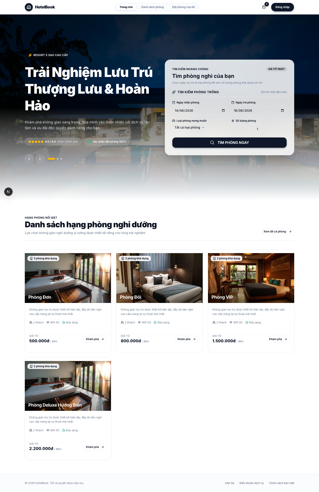

Trang "Danh sách phòng" cho kết quả tìm kiếm đầy đủ hơn: bộ lọc theo hạng phòng, khoảng giá và
tiện nghi ở cột trái, danh sách phòng còn trống ở giữa - mỗi phòng hiển thị số phòng cụ thể
(ví dụ: `Phòng 102`), hạng phòng, sức chứa, diện tích, tiện nghi nổi bật và trạng thái sẵn sàng đón
khách, kèm giá theo đêm và nút xem chi tiết / chọn phòng ngay. Kết quả có phân trang khi số
lượng phòng trống lớn.

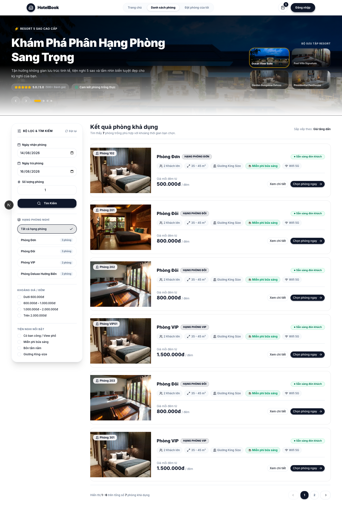

### 2.1.2. Chi tiết loại phòng

Trang chi tiết một loại phòng gồm thư viện ảnh, mô tả, các thông số chính (sức chứa, diện tích,
wifi, bữa sáng) và danh sách tiện nghi phòng tiêu chuẩn. Cột bên phải cho biết số phòng còn
trống, đơn giá theo đêm, ô chọn số lượng phòng muốn đặt (giới hạn theo số phòng trống thật) và
tổng chi phí tính sẵn trước khi bấm đặt phòng.

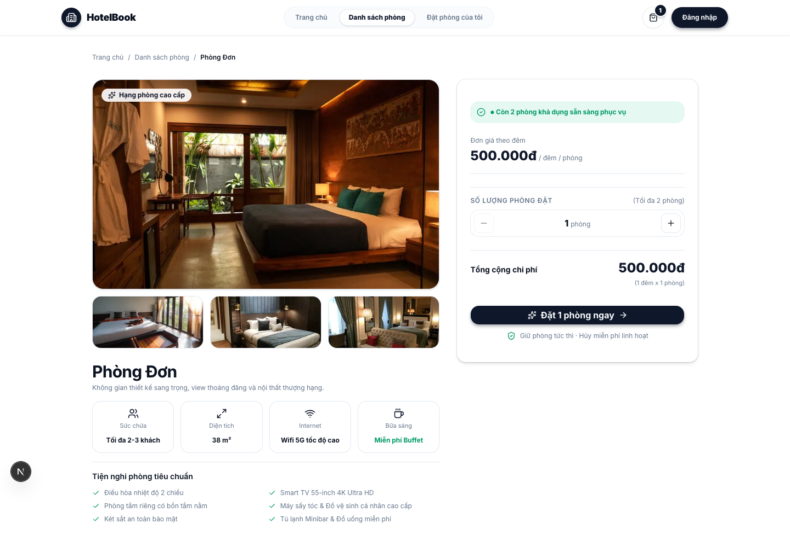

### 2.1.3. Giỏ phòng & lịch lưu trú

Giỏ phòng gom các phòng khách đã chọn (có thể từ nhiều loại phòng khác nhau trong cùng một lượt
đặt), cho chỉnh lại ngày nhận/trả phòng chung cho cả giỏ, và tính lại tổng tiền phòng theo số
đêm thực tế. Cột bên phải tóm tắt đơn: tiền phòng, thuế VAT & phí dịch vụ, và tổng thanh toán
cuối cùng - khách xác nhận đúng số tiền trước khi sang bước thanh toán.

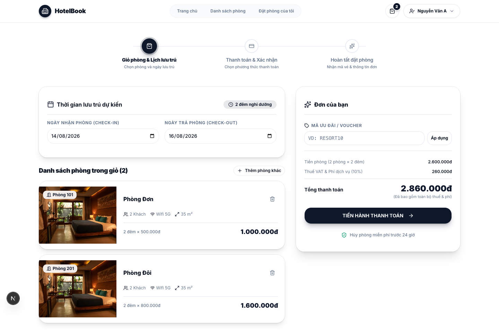

### 2.1.4. Thanh toán

Luồng đặt phòng chia rõ 3 bước (giỏ phòng → thanh toán & xác nhận → hoàn tất), thể hiện bằng
thanh tiến trình ở đầu trang để khách biết đang ở bước nào. Bước thanh toán yêu cầu thông tin
khách nhận phòng (họ tên, số điện thoại, yêu cầu đặc biệt không bắt buộc) và cho chọn một trong
ba phương thức thanh toán mô phỏng: chuyển khoản/QR ngân hàng, thẻ tín dụng quốc tế, hoặc tiền
mặt tại khách sạn. Toàn bộ ba phương thức đều xác nhận thành công ngay lập tức, đúng với phạm vi
đã nêu - hệ thống chưa nối cổng thanh toán thật.

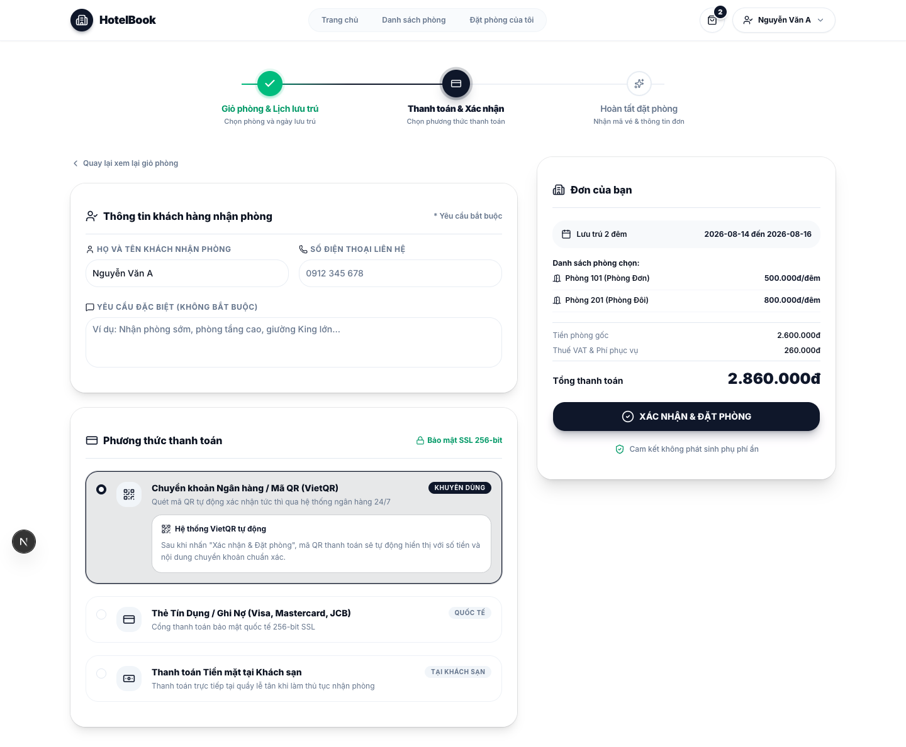

### 2.1.5. Lịch sử đặt phòng & tự hủy

Trang "Đặt phòng của tôi" tổng hợp toàn bộ đơn của khách theo trạng thái (tất cả / đã xác nhận /
đang lưu trú / đã hoàn tất / đã hủy), kèm 3 số liệu nhanh ở đầu trang (tổng đơn, đơn sắp lưu
trú, kỳ nghỉ đã hoàn tất). Mỗi đơn hiển thị mã đơn, trạng thái, ngày đặt, tổng chi phí, khoảng
ngày lưu trú và phòng đã đặt. Khách bấm vào chi tiết đơn để xem đầy đủ và thực hiện tự hủy khi
cần, thao tác hủy sẽ tạo một yêu cầu hoàn tiền chờ quản trị viên duyệt (xem mục 2.2.5), bản
thân đơn vẫn giữ nguyên trạng thái cho tới khi yêu cầu đó được xử lý xong.

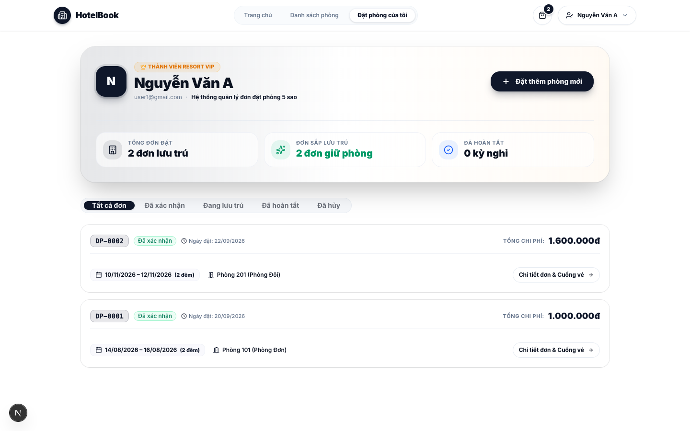

## 2.2. Trang quản trị (CMS)

### 2.2.1. Dashboard

Dashboard cho quản trị viên cái nhìn tổng quan vận hành ngay khi đăng nhập: số đơn chờ xác
nhận, số đơn đã xác nhận, doanh thu trong tháng, tỉ lệ phòng trống/đang sử dụng, và số yêu cầu
hoàn tiền đang chờ duyệt. Bên dưới là hai bảng rút gọn - yêu cầu hoàn tiền cần xử lý và các đơn
đặt phòng mới nhất - giúp quản trị viên vào thẳng việc cần làm mà không phải tìm qua từng trang
riêng.

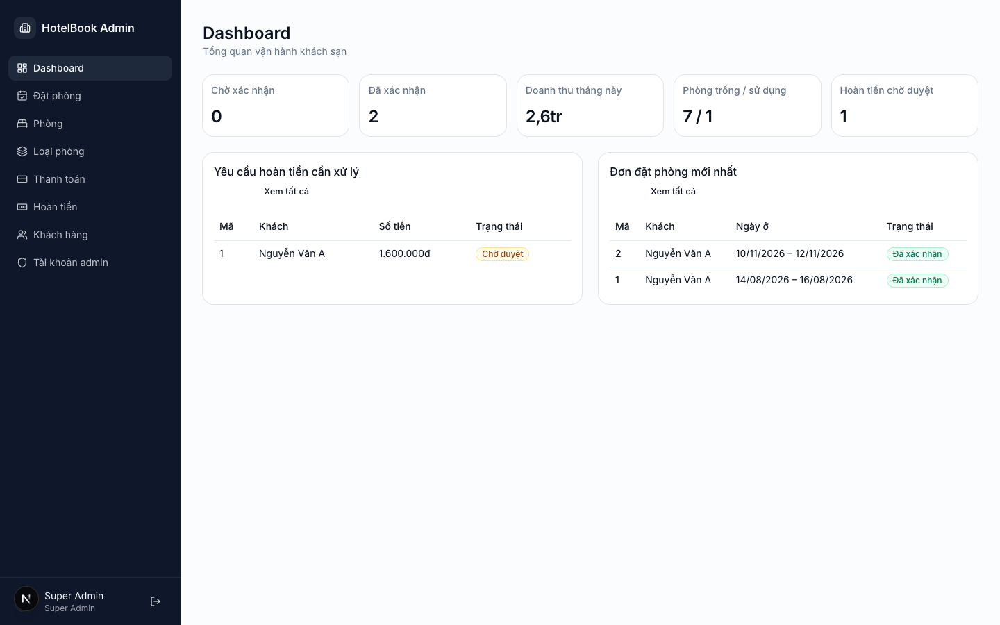

### 2.2.2. Quản lý loại phòng & phòng

Trang quản lý loại phòng cho phép tạo, sửa, xoá từng hạng phòng (tên loại, giá cơ bản) và hiển thị
số phòng cụ thể thuộc mỗi loại, có ô tìm kiếm và phân trang khi danh sách dài. Quản lý phòng cụ
thể (không chụp riêng, cùng nhóm chức năng) cho phép cập nhật trạng thái từng phòng (sẵn sàng,
đang sử dụng, bảo trì…), phục vụ đúng dữ liệu hiển thị "còn trống" ở phía khách.

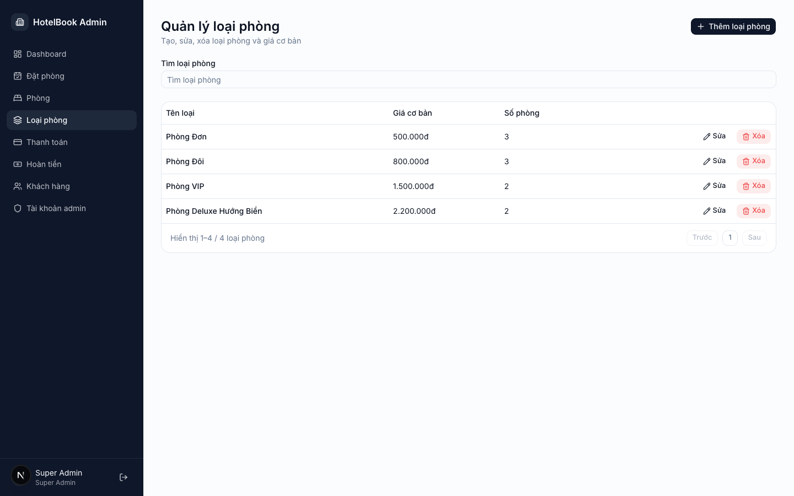

### 2.2.3. Quản lý đơn đặt phòng

Trang quản lý đơn tổng hợp toàn bộ đơn đặt phòng của khách trên toàn hệ thống - khác với trang
"lịch sử đặt phòng" phía khách chỉ thấy đơn của chính mình. Quản trị viên xem được người đặt,
khoảng ngày lưu trú, phòng đã đặt và trạng thái đơn, phục vụ đối soát vận hành hằng ngày.

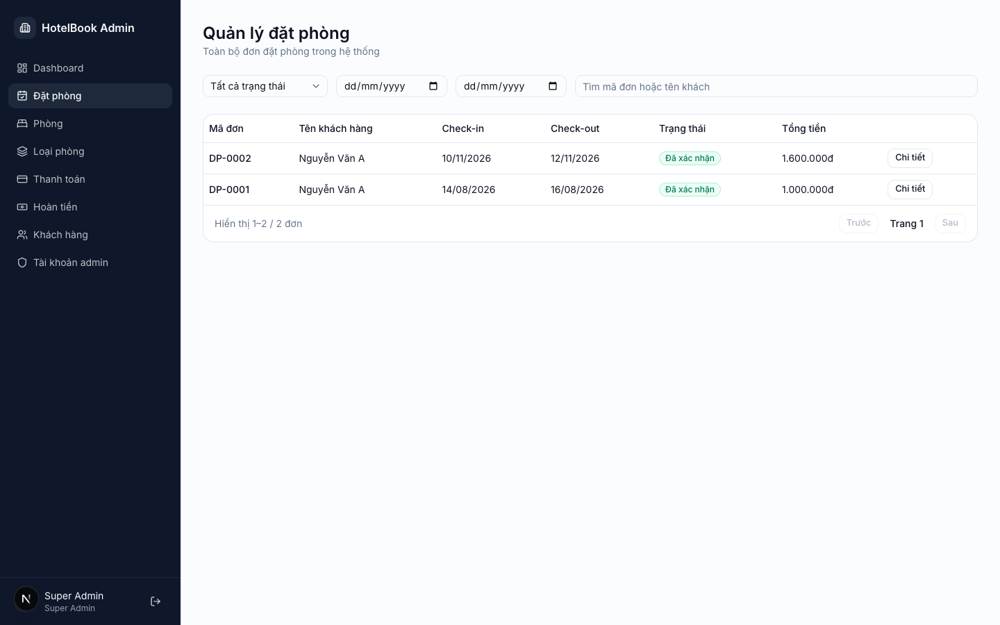

### 2.2.4. Quản lý thanh toán

Trang thanh toán liệt kê từng giao dịch gắn với một đơn đặt phòng cụ thể: số tiền, phương thức
(chuyển khoản, thẻ, tiền mặt), trạng thái thanh toán và ngày giao dịch, có bộ lọc theo trạng
thái và phương thức để tra soát nhanh khi cần đối chiếu doanh thu.

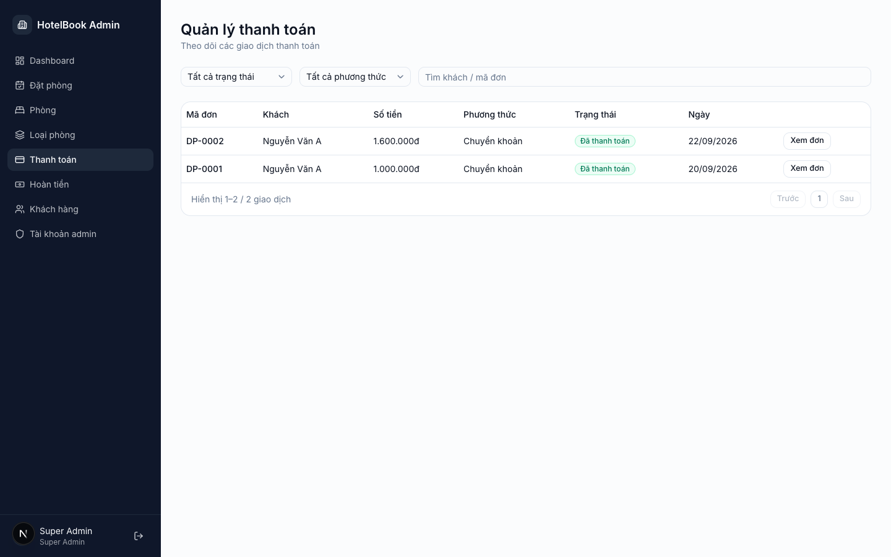

### 2.2.5. Duyệt yêu cầu hoàn tiền

Khi khách tự hủy đơn (mục 2.1.5), một yêu cầu hoàn tiền ở trạng thái "chờ duyệt" xuất hiện tại
đây, kèm mã đơn liên quan, số tiền cần hoàn và lý do khách khai báo lúc hủy. Quản trị viên duyệt
hoặc từ chối ngay trên dòng yêu cầu. Duyệt sẽ chuyển đơn đặt phòng gốc sang trạng thái đã hủy và
đóng yêu cầu hoàn tiền, từ chối giữ nguyên đơn như trước khi khách yêu cầu hủy.

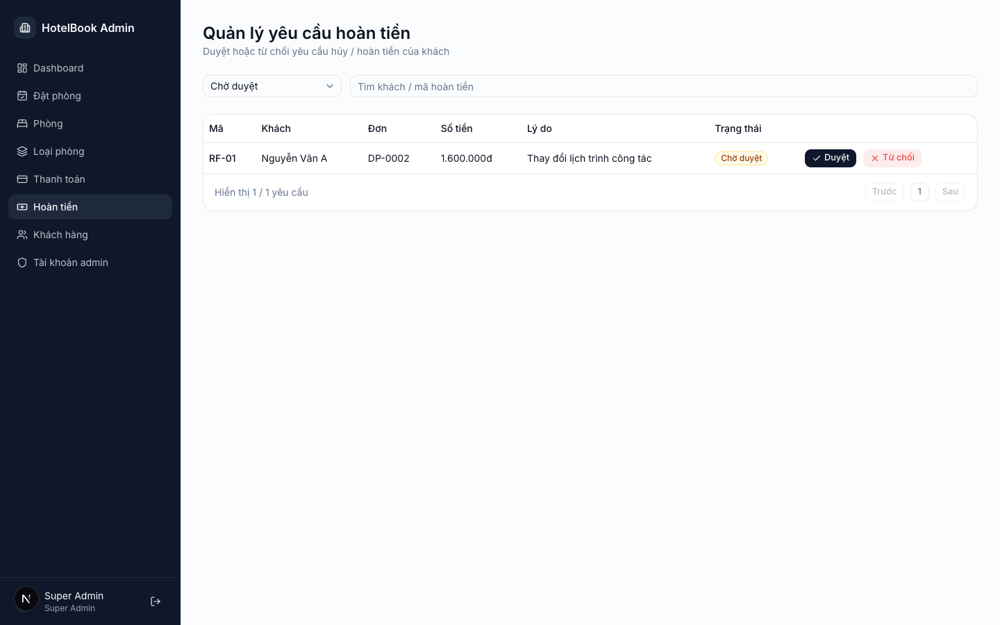

### 2.2.6. Quản lý khách hàng & tài khoản nhân viên

Trang quản lý khách hàng liệt kê toàn bộ tài khoản khách (họ tên, email, số điện thoại, trạng
thái) và cho phép khoá/mở khoá từng tài khoản khi cần - tài khoản bị khoá sẽ không đăng nhập
được ở phía khách. Quản lý tài khoản nhân viên (cùng nhóm chức năng, không chụp riêng) cho phép
tạo tài khoản quản trị mới và gán vai trò Super Admin hoặc Staff.

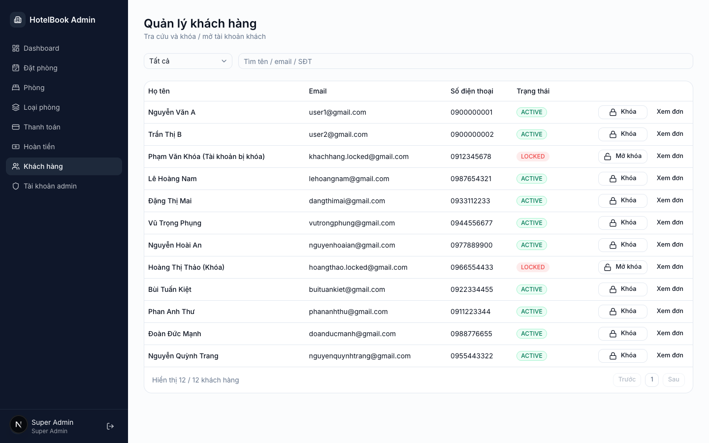

## 2.3. Ngoài phạm vi

Những hạng mục sau được nhóm chủ động khoanh vùng là chưa hiện thực, để không hiểu nhầm là phần
còn thiếu ngoài kế hoạch:

- Cổng thanh toán thật (VNPay, Momo, …) - cả ba phương thức ở bước thanh toán (mục 2.1.4) đều
  chỉ mô phỏng, xác nhận thành công ngay khi khách bấm xác nhận.
- Cơ chế xác thực JWT ký số theo chuẩn production: hệ thống hiện dùng token demo đơn giản (xem
  mục 1.2).
- Tách giao diện theo từng quyền chi tiết (`ROLE_PERMISSIONS`) - hiện quyền chỉ phân biệt ở mức
  vai trò (Super Admin / Staff), chưa ẩn/hiện chức năng theo từng quyền cụ thể.
