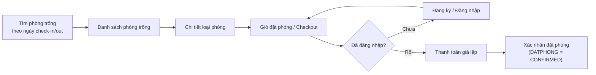
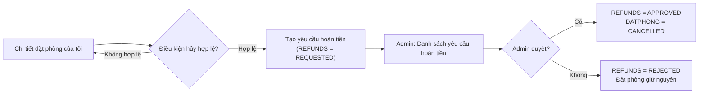

# Tài liệu Màn hình Nghiệp vụ — Hệ thống Quản lý Đặt phòng

Tài liệu này mô tả các màn hình cần có ở phía **Khách hàng (Public)** và **Quản trị (Admin)**, suy ra từ sơ đồ quan hệ thực thể tại [`documents/sql/erd.md`](./sql/erd.md) và các quyết định nghiệp vụ đã chốt cùng người dùng. Mục tiêu là làm nền để thiết kế UI/UX (Figma, Penpot...) và REST API.

Spec OpenAPI / Swagger tương ứng nằm tại [`documents/openapi.yaml`](./openapi.yaml) (mở trên [Swagger Editor](https://editor.swagger.io)). Ma trận màn hình ↔ endpoint ở [mục 8](#8-ma-trận-màn-hình--api).

## 1. Giới thiệu & phạm vi

**Đối tượng đọc**: thành viên nhóm phụ trách frontend (Next.js — `apps/web`) và backend (FastAPI — `backend`), dùng để thống nhất trước khi vẽ wireframe/UI chi tiết.

**Giả định đã chốt** (từ trao đổi với người dùng):

| Chủ đề | Quyết định |
|--------|-----------|
| Vai trò admin | Một bộ UI admin dùng chung cho `SUPER_ADMIN` và `STAFF`, chưa tách luồng riêng ở giai đoạn này. Bảng `ROLES`/`PERMISSIONS`/`ADMIN_ROLES`/`ROLE_PERMISSIONS` vẫn giữ trong DB để mở rộng sau. |
| Thanh toán | Giả lập: khách chọn phương thức thanh toán, hệ thống tự đánh dấu `PAID`, không tích hợp cổng thanh toán thật (VNPay/Momo...). |
| Hủy & hoàn tiền | Tự phục vụ: khách tự bấm "Hủy đặt phòng" trên trang của mình để tạo yêu cầu hoàn tiền, admin duyệt hoặc từ chối (`REFUNDS.approved_by`). |
| Quản lý phòng | Admin có màn hình CRUD đầy đủ cho `LOAIPHONG` (loại phòng) và `PHONG` (phòng vật lý), không chỉ dùng dữ liệu seed sẵn. |
| Mức độ chi tiết | Mỗi màn hình mô tả: mục đích, dữ liệu hiển thị/nhập (map theo cột trong ERD), hành động chính, điều kiện hiển thị. Không đi sâu bố cục UI (layout) hay wireframe. |

**Ngoài phạm vi tài liệu này**: bố cục giao diện cụ thể (nằm ở bước thiết kế `design.pen`). Thiết kế REST API nằm ở [`documents/openapi.yaml`](./openapi.yaml).

## 2. Luồng nghiệp vụ tổng quan

### 2.1. Luồng đặt phòng & thanh toán

Ghi chú: mỗi lượt checkout tạo một bản ghi `DATPHONG` (header) và một hoặc nhiều bản ghi `CT_DATPHONG` (mỗi phòng được chọn, đơn giá chốt tại thời điểm đặt). `PAYMENTS` được tạo gắn với `DATPHONG` đó khi thanh toán giả lập thành công.

### 2.2. Luồng hủy & hoàn tiền

Ghi chú: "điều kiện hủy hợp lệ" (ví dụ chưa tới ngày check-in, đơn chưa `CANCELLED`) là quy tắc nghiệp vụ cần thống nhất thêm khi thiết kế chi tiết — xem mục 7.

## 3. Trạng thái đề xuất (chưa có trong schema hiện tại)

Schema hiện tại (`documents/sql/postgres/init_tables.sql`) chỉ khai báo giá trị `DEFAULT` cho các cột trạng thái, chưa liệt kê đầy đủ tập giá trị hợp lệ. Bảng dưới đây là **đề xuất** để tài liệu màn hình có căn cứ mô tả điều kiện hiển thị; cần người dùng xác nhận thêm khi hiện thực hóa (ví dụ bằng `CHECK CONSTRAINT` hoặc enum ở tầng ứng dụng), tài liệu này **không tự ý sửa schema**.

| Cột | Giá trị đề xuất | Ý nghĩa |
|-----|------------------|---------|
| `DATPHONG.trang_thai` | `PENDING`, `CONFIRMED`, `CHECKED_IN`, `CHECKED_OUT`, `CANCELLED` | Vòng đời một đơn đặt phòng |
| `PHONG.trang_thai` | `AVAILABLE`, `OCCUPIED`, `MAINTENANCE` | Trạng thái vận hành của phòng vật lý |
| `PAYMENTS.status` | `PENDING`, `PAID`, `FAILED` | Trạng thái thanh toán giả lập |
| `REFUNDS.status` | `REQUESTED`, `APPROVED`, `REJECTED` | Vòng đời một yêu cầu hoàn tiền |

## 4. Nhóm màn hình Khách hàng (Public)

### 4.1. Tổng quan

| # | Màn hình | Bảng ERD liên quan chính |
|---|----------|---------------------------|
| P1 | Trang chủ / Tìm phòng trống | `LOAIPHONG`, `PHONG` |
| P2 | Danh sách kết quả phòng trống | `LOAIPHONG`, `PHONG`, `DATPHONG`, `CT_DATPHONG` |
| P3 | Chi tiết loại phòng | `LOAIPHONG`, `PHONG` |
| P4 | Giỏ đặt phòng / Checkout | `DATPHONG`, `CT_DATPHONG` |
| P5 | Đăng ký / Đăng nhập | `USERS` |
| P6 | Thanh toán giả lập | `PAYMENTS` |
| P7 | Xác nhận đặt phòng thành công | `DATPHONG`, `CT_DATPHONG`, `PAYMENTS` |
| P8 | Danh sách đặt phòng của tôi | `DATPHONG` |
| P9 | Chi tiết đặt phòng của tôi | `DATPHONG`, `CT_DATPHONG`, `PAYMENTS`, `REFUNDS` |
| P10 | Tài khoản cá nhân | `USERS` |

### 4.2. Chi tiết từng màn hình

**P1 — Trang chủ / Tìm phòng trống**

- Mục đích: điểm vào chính, cho khách chọn ngày check-in/check-out và (tùy chọn) loại phòng để tìm phòng trống.
- Dữ liệu nhập: ngày check-in, ngày check-out, loại phòng mong muốn (tùy chọn), số lượng phòng cần.
- Dữ liệu hiển thị: danh sách `LOAIPHONG` kèm `gia_co_ban` để giới thiệu.
- Hành động chính: bấm "Tìm phòng" → chuyển sang P2 kèm query params ngày/loại phòng.
- Điều kiện hiển thị: không yêu cầu đăng nhập.

**P2 — Danh sách kết quả phòng trống**

- Mục đích: hiển thị các phòng còn trống trong khoảng ngày đã chọn, theo từng loại phòng.
- Dữ liệu hiển thị: `PHONG.so_phong`, `LOAIPHONG.ten_loai`, `LOAIPHONG.gia_co_ban`, số lượng phòng trống theo loại.
- Logic lọc: một `PHONG` được coi là còn trống nếu không có `CT_DATPHONG` nào nối với `DATPHONG` có khoảng `check_in`–`check_out` giao với khoảng ngày khách chọn và `DATPHONG.trang_thai` chưa `CANCELLED`.
- Hành động chính: chọn một hoặc nhiều phòng → thêm vào giỏ (P4); xem chi tiết loại phòng (P3).
- Điều kiện hiển thị: nếu không có phòng trống, hiển thị trạng thái rỗng gợi ý đổi ngày/loại phòng.

**P3 — Chi tiết loại phòng**

- Mục đích: cung cấp thông tin loại phòng trước khi khách quyết định đặt.
- Dữ liệu hiển thị: `LOAIPHONG.ten_loai`, `LOAIPHONG.gia_co_ban`, danh sách phòng cụ thể còn trống thuộc loại này (`PHONG.so_phong`, `PHONG.trang_thai`).
- Hành động chính: thêm phòng vào giỏ (P4).
- Điều kiện hiển thị: nút đặt phòng chỉ bật khi còn phòng trống thuộc loại này trong khoảng ngày đã chọn ở P1/P2.

**P4 — Giỏ đặt phòng / Checkout**

- Mục đích: cho khách xem lại các phòng đã chọn trước khi xác nhận đặt (tương ứng dữ liệu sẽ ghi vào `DATPHONG` + nhiều `CT_DATPHONG`).
- Dữ liệu hiển thị: danh sách phòng đã chọn (`PHONG.so_phong`, loại phòng, đơn giá — trở thành `CT_DATPHONG.don_gia`), ngày check-in/check-out, tổng tiền tạm tính.
- Dữ liệu nhập: có thể xóa bớt phòng khỏi giỏ, chỉnh lại ngày.
- Hành động chính: bấm "Tiếp tục" → nếu chưa đăng nhập, chuyển P5; nếu đã đăng nhập, chuyển P6.
- Điều kiện hiển thị: nếu giỏ rỗng, quay lại P2.

**P5 — Đăng ký / Đăng nhập**

- Mục đích: xác thực khách hàng trước khi tạo đơn đặt phòng chính thức.
- Dữ liệu nhập (đăng ký): `USERS.email`, `USERS.phone`, mật khẩu (lưu thành `password_hash`), `USERS.full_name`.
- Dữ liệu nhập (đăng nhập): email, mật khẩu.
- Hành động chính: đăng ký/đăng nhập thành công → quay lại P4 với giỏ hàng được giữ nguyên → tiếp tục sang P6.
- Điều kiện hiển thị: chỉ hiện khi khách chưa đăng nhập và đang trong luồng đặt phòng (hoặc truy cập trực tiếp).

**P6 — Thanh toán giả lập**

- Mục đích: hoàn tất đơn đặt phòng bằng bước thanh toán mô phỏng (không qua cổng thanh toán thật).
- Dữ liệu hiển thị: tóm tắt đơn (phòng, ngày, tổng tiền = `PAYMENTS.amount`).
- Dữ liệu nhập: chọn `PAYMENTS.method` (ví dụ `BANKING`, `CASH`).
- Hành động chính: bấm "Xác nhận thanh toán" → hệ thống tạo `DATPHONG` (nếu chưa có) + `CT_DATPHONG` + `PAYMENTS` với `status = PAID`, đồng thời cập nhật `DATPHONG.trang_thai = CONFIRMED`.
- Điều kiện hiển thị: chỉ truy cập được khi đã đăng nhập và giỏ hàng còn hợp lệ (phòng chưa bị người khác đặt mất trong lúc chờ).

**P7 — Xác nhận đặt phòng thành công**

- Mục đích: xác nhận đơn đã tạo thành công, giảm lo lắng cho khách.
- Dữ liệu hiển thị: mã đơn (`DATPHONG.id`), danh sách phòng đã đặt, tổng tiền đã thanh toán, trạng thái `CONFIRMED`.
- Hành động chính: xem chi tiết đơn (chuyển sang P9), quay về trang chủ.

**P8 — Danh sách đặt phòng của tôi**

- Mục đích: cho khách xem lại lịch sử đặt phòng.
- Dữ liệu hiển thị: danh sách `DATPHONG` lọc theo `user_id` hiện tại — ngày đặt (`created_at`), ngày ở, `trang_thai`, tổng tiền.
- Hành động chính: lọc theo trạng thái; bấm vào một đơn để xem chi tiết (P9).
- Điều kiện hiển thị: yêu cầu đăng nhập.

**P9 — Chi tiết đặt phòng của tôi**

- Mục đích: xem đầy đủ thông tin một đơn và thực hiện hủy nếu cần.
- Dữ liệu hiển thị: thông tin `DATPHONG`, danh sách `CT_DATPHONG` (phòng + đơn giá), `PAYMENTS` liên quan, `REFUNDS` liên quan (nếu có).
- Hành động chính: bấm "Hủy đặt phòng" → tạo bản ghi `REFUNDS` với `status = REQUESTED` (theo luồng mục 2.2).
- Điều kiện hiển thị: nút "Hủy đặt phòng" chỉ hiện khi `DATPHONG.trang_thai` thuộc nhóm còn hủy được (ví dụ `PENDING`/`CONFIRMED`, chưa `CHECKED_IN`) và chưa có `REFUNDS` nào đang ở trạng thái `REQUESTED`/`APPROVED` cho đơn này.

**P10 — Tài khoản cá nhân**

- Mục đích: cho khách cập nhật thông tin cá nhân.
- Dữ liệu hiển thị/nhập: `USERS.email` (chỉ xem), `USERS.phone`, `USERS.full_name`, đổi mật khẩu.
- Hành động chính: lưu thay đổi.
- Điều kiện hiển thị: yêu cầu đăng nhập.

## 5. Nhóm màn hình Quản trị (Admin)

### 5.1. Tổng quan

| # | Màn hình | Bảng ERD liên quan chính |
|---|----------|---------------------------|
| A1 | Đăng nhập admin | `ADMINS` |
| A2 | Dashboard tổng quan | `DATPHONG`, `PAYMENTS`, `PHONG` |
| A3 | Quản lý loại phòng (CRUD) | `LOAIPHONG` |
| A4 | Quản lý phòng (CRUD) | `PHONG`, `LOAIPHONG` |
| A5 | Quản lý đặt phòng (danh sách) | `DATPHONG` |
| A6 | Chi tiết đặt phòng (admin) | `DATPHONG`, `CT_DATPHONG`, `PAYMENTS` |
| A7 | Quản lý thanh toán | `PAYMENTS` |
| A8 | Quản lý yêu cầu hoàn tiền | `REFUNDS`, `PAYMENTS` |
| A9 | Quản lý khách hàng | `USERS` |
| A10 | Quản lý tài khoản admin & phân quyền | `ADMINS`, `ROLES`, `PERMISSIONS`, `ADMIN_ROLES`, `ROLE_PERMISSIONS` |

### 5.2. Chi tiết từng màn hình

**A1 — Đăng nhập admin**

- Mục đích: xác thực nhân viên/quản trị viên, tách biệt với đăng nhập khách hàng (`USERS`).
- Dữ liệu nhập: `ADMINS.email`, mật khẩu.
- Hành động chính: đăng nhập → chuyển vào A2.

**A2 — Dashboard tổng quan**

- Mục đích: cho admin nắm nhanh tình hình vận hành.
- Dữ liệu hiển thị: số đơn đặt phòng theo trạng thái (đếm từ `DATPHONG.trang_thai`), doanh thu theo `PAYMENTS.status = PAID`, số phòng đang `AVAILABLE`/`OCCUPIED` (`PHONG.trang_thai`), số yêu cầu hoàn tiền đang chờ (`REFUNDS.status = REQUESTED`).
- Hành động chính: điều hướng nhanh tới các màn hình A5/A8 khi có mục cần xử lý.

**A3 — Quản lý loại phòng (CRUD)**

- Mục đích: tạo/sửa/xóa loại phòng và giá cơ bản.
- Dữ liệu hiển thị: danh sách `LOAIPHONG` (`ten_loai`, `gia_co_ban`, số phòng thuộc loại).
- Dữ liệu nhập (tạo/sửa): `ten_loai`, `gia_co_ban`.
- Hành động chính: thêm mới, sửa, xóa.
- Điều kiện hiển thị: chặn xóa nếu `LOAIPHONG` đang có `PHONG` tham chiếu (ràng buộc FK `PHONG.loai_phong_id`).

**A4 — Quản lý phòng (CRUD)**

- Mục đích: tạo/sửa/xóa phòng vật lý và cập nhật trạng thái vận hành.
- Dữ liệu hiển thị: danh sách `PHONG` (`so_phong`, loại phòng, `trang_thai`).
- Dữ liệu nhập (tạo/sửa): `so_phong`, `loai_phong_id` (chọn từ A3), `trang_thai`.
- Hành động chính: thêm mới, sửa, xóa, đổi nhanh trạng thái (ví dụ chuyển `MAINTENANCE`).
- Điều kiện hiển thị: chặn xóa/đổi trạng thái nếu phòng đang có `CT_DATPHONG` gắn với đơn chưa hoàn tất.

**A5 — Quản lý đặt phòng (danh sách)**

- Mục đích: xem toàn bộ đơn đặt phòng trong hệ thống.
- Dữ liệu hiển thị: `DATPHONG.id`, khách hàng (`USERS.full_name`), ngày ở, `trang_thai`, tổng tiền.
- Hành động chính: lọc theo `trang_thai`, khoảng ngày; bấm vào một đơn để xem chi tiết (A6).

**A6 — Chi tiết đặt phòng (admin)**

- Mục đích: xem đầy đủ và can thiệp vào một đơn khi cần (ví dụ xác nhận thủ công, đánh dấu check-in/check-out).
- Dữ liệu hiển thị: `DATPHONG`, danh sách `CT_DATPHONG` (phòng + đơn giá), `PAYMENTS` liên quan.
- Hành động chính: cập nhật `trang_thai` (ví dụ `PENDING → CONFIRMED`, `CONFIRMED → CHECKED_IN`, `CHECKED_IN → CHECKED_OUT`).
- Điều kiện hiển thị: các hành động chuyển trạng thái chỉ hiện khi hợp lệ theo vòng đời ở mục 3 (không cho nhảy ngược trạng thái).

**A7 — Quản lý thanh toán**

- Mục đích: theo dõi các giao dịch thanh toán giả lập.
- Dữ liệu hiển thị: danh sách `PAYMENTS` (`booking_id`, khách hàng, `amount`, `method`, `status`, `created_at`).
- Hành động chính: lọc theo `status`/`method`; xem đơn đặt phòng liên quan (chuyển A6).

**A8 — Quản lý yêu cầu hoàn tiền**

- Mục đích: xử lý các yêu cầu hủy/hoàn tiền do khách tạo (theo luồng mục 2.2).
- Dữ liệu hiển thị: danh sách `REFUNDS` (ưu tiên `status = REQUESTED`), kèm `reason`, `refund_amount`, thông tin `PAYMENTS`/`DATPHONG` liên quan.
- Hành động chính: "Duyệt" (ghi `REFUNDS.approved_by = admin hiện tại`, `status = APPROVED`, đồng thời cập nhật `DATPHONG.trang_thai = CANCELLED`) hoặc "Từ chối" (`status = REJECTED`).
- Điều kiện hiển thị: chỉ admin có quyền `APPROVE_REFUND` (theo `PERMISSIONS`/`ROLE_PERMISSIONS`) mới thấy nút Duyệt/Từ chối — dù UI dùng chung, có thể ẩn nút theo quyền.

**A9 — Quản lý khách hàng**

- Mục đích: hỗ trợ tra cứu và quản lý tài khoản khách hàng.
- Dữ liệu hiển thị: danh sách `USERS` (`email`, `phone`, `full_name`, `status`).
- Hành động chính: khóa/mở tài khoản (`status = ACTIVE`/khác); xem lịch sử đặt phòng của khách đó (liên kết sang A5 đã lọc theo `user_id`).

**A10 — Quản lý tài khoản admin & phân quyền**

- Mục đích: quản lý người dùng nội bộ và việc gán vai trò/quyền.
- Dữ liệu hiển thị: danh sách `ADMINS` (`email`, `full_name`, `status`), vai trò hiện có của mỗi admin (qua `ADMIN_ROLES` → `ROLES`).
- Dữ liệu hiển thị phụ: danh sách `ROLES` và `PERMISSIONS` (qua `ROLE_PERMISSIONS`) — có thể chỉ ở dạng xem, vì với quyết định "một bộ UI chung" ở giai đoạn này, việc tạo mới role/permission chưa cấp thiết.
- Hành động chính: tạo/sửa/khóa tài khoản admin; gán/gỡ `ROLES` cho một `ADMINS` (thao tác lên `ADMIN_ROLES`).
- Điều kiện hiển thị: màn hình nhạy cảm, nên giới hạn cho vai trò cao nhất (`SUPER_ADMIN`) dù UI admin đang dùng chung.

## 6. Ma trận Màn hình ↔ Bảng ERD

| Bảng ERD | Màn hình sử dụng |
|----------|-------------------|
| `USERS` | P5, P8, P9, P10, A9 |
| `ADMINS` | A1, A10, A8 (người duyệt) |
| `ROLES` | A10 |
| `PERMISSIONS` | A10, A8 (kiểm tra quyền) |
| `ADMIN_ROLES` | A10 |
| `ROLE_PERMISSIONS` | A10 |
| `LOAIPHONG` | P1, P2, P3, A2, A3, A4 |
| `PHONG` | P1, P2, P3, A2, A4, A6 |
| `DATPHONG` | P4, P6, P7, P8, P9, A2, A5, A6 |
| `CT_DATPHONG` | P4, P6, P7, P9, A6 |
| `PAYMENTS` | P6, P7, P9, A2, A6, A7, A8 |
| `REFUNDS` | P9, A2, A8 |

## 7. Giới hạn & câu hỏi mở còn lại

Các điểm sau **chưa được hỗ trợ đầy đủ bởi ERD hiện tại** (`documents/sql/erd.md`) và cần người dùng cân nhắc trước khi thiết kế UI/API chi tiết. Tài liệu này không tự ý thêm bảng vào schema:

1. **Ảnh & tiện ích phòng**: `LOAIPHONG`/`PHONG` chưa có bảng lưu ảnh minh họa hay danh sách tiện ích (wifi, điều hòa...). Các màn hình P1–P3 hiện chỉ có thể hiển thị tên loại phòng và giá.
2. **Sức chứa / số khách tối đa**: chưa có cột nào trong `LOAIPHONG`/`PHONG` thể hiện số khách tối đa, nên P1 chưa thể lọc theo "số khách".
3. **Thông báo**: chưa có bảng lưu lịch sử gửi email/SMS xác nhận đặt phòng, nhắc thanh toán, hay thông báo kết quả duyệt hoàn tiền.
4. **Audit log**: các hành động đổi trạng thái ở A6/A8 hiện không có bảng log ai đã thao tác, vào lúc nào (ngoài `approved_by`/`created_at` sẵn có ở `REFUNDS`).
5. **Điều kiện hủy hợp lệ (mục 2.2)**: cần thống nhất quy tắc cụ thể (ví dụ: chỉ hủy được trước check-in bao nhiêu giờ, có hoàn 100% hay theo chính sách) — hiện là giả định để mô tả điều kiện hiển thị nút "Hủy" ở P9.
6. **Đăng ký tài khoản admin (A10)**: `ADMINS` không có cột nào đánh dấu "ai tạo admin này" — nếu cần kiểm soát chặt, có thể cần bổ sung sau.
7. **P10 Tài khoản cá nhân**: đã mô tả ở mục 4 nhưng frontend hiện chưa có route `/account` (profile). Spec API mới có `GET /api/v1/auth/me` cho header; `PUT /me` chưa đưa vào OpenAPI cho đến khi có UI.
8. **Giỏ đặt phòng (P4)**: không có API giỏ — giữ phía client. Nút "Áp dụng" ngày nên gọi lại `GET /api/v1/rooms/availability`.

## 8. Ma trận Màn hình ↔ API

Chi tiết schema, query, body và mã lỗi: [`documents/openapi.yaml`](./openapi.yaml). Prefix `/api/v1`. Auth khách = `UserBearer`; auth admin = `AdminBearer`.

### 8.1. Khách hàng (Public)

| # | Màn hình | Route frontend | Method | Endpoint |
|---|----------|----------------|--------|----------|
| P1 | Trang chủ / Tìm phòng trống | `/` | `GET` | `/api/v1/room-types` |
| P2 | Danh sách kết quả phòng trống | `/rooms` | `GET` | `/api/v1/rooms/availability` |
| P3 | Chi tiết loại phòng | `/rooms/[id]` | `GET` | `/api/v1/room-types/{id}` |
| P4 | Giỏ đặt phòng | `/cart` | — | Client-side; Áp dụng ngày → `GET /api/v1/rooms/availability` |
| P5 | Đăng ký | `/login` (tab Đăng ký) | `POST` | `/api/v1/auth/register` |
| P5 | Đăng nhập | `/login` (tab Đăng nhập) | `POST` | `/api/v1/auth/login` |
| — | Header (tên user / đăng xuất) | layout public | `GET` / `POST` | `/api/v1/auth/me`, `/api/v1/auth/logout` |
| P6 | Thanh toán giả lập | `/checkout` | `POST` | `/api/v1/bookings` |
| P7 | Xác nhận đặt phòng thành công | `/checkout/success` | `GET` | `/api/v1/bookings/{id}` |
| P8 | Danh sách đặt phòng của tôi | `/account/bookings` | `GET` | `/api/v1/bookings` |
| P9 | Chi tiết đặt phòng của tôi | `/account/bookings/[id]` | `GET` | `/api/v1/bookings/{id}` |
| P9 | Hủy đặt phòng | dialog trên P9 | `POST` | `/api/v1/bookings/{id}/cancel` |
| P10 | Tài khoản cá nhân | *(chưa có UI)* | `GET` | `/api/v1/auth/me` |

### 8.2. Quản trị (Admin)

| # | Màn hình | Route frontend | Method | Endpoint |
|---|----------|----------------|--------|----------|
| A1 | Đăng nhập admin | `/admin/login` | `POST` | `/api/v1/admin/auth/login` |
| A2 | Dashboard | `/admin` | `GET` | `/api/v1/admin/dashboard`, `/api/v1/admin/auth/me` |
| A3 | DS loại phòng | `/admin/room-types` | `GET` | `/api/v1/admin/room-types` |
| A3 | Thêm loại phòng | `/admin/room-types/new` | `POST` | `/api/v1/admin/room-types` |
| A3 | Sửa loại phòng | `/admin/room-types/[id]/edit` | `GET` `PUT` | `/api/v1/admin/room-types/{id}` |
| A3 | Xóa loại phòng | dialog trên A3 | `DELETE` | `/api/v1/admin/room-types/{id}` |
| A4 | DS phòng | `/admin/rooms` | `GET` | `/api/v1/admin/rooms` |
| A4 | Thêm phòng | `/admin/rooms/new` | `POST` | `/api/v1/admin/rooms` |
| A4 | Sửa phòng | `/admin/rooms/[id]/edit` | `GET` `PUT` | `/api/v1/admin/rooms/{id}` |
| A4 | Bảo trì / xóa phòng | actions trên A4 | `PATCH` `DELETE` | `/api/v1/admin/rooms/{id}/status`, `/api/v1/admin/rooms/{id}` |
| A5 | DS đặt phòng | `/admin/bookings` | `GET` | `/api/v1/admin/bookings` |
| A6 | Chi tiết đặt phòng | `/admin/bookings/[id]` | `GET` | `/api/v1/admin/bookings/{id}` |
| A6 | Xác nhận / nhận / trả phòng | nút trên A6 | `PATCH` | `/api/v1/admin/bookings/{id}/status` |
| A7 | Quản lý thanh toán | `/admin/payments` | `GET` | `/api/v1/admin/payments` |
| A8 | DS hoàn tiền | `/admin/refunds` | `GET` | `/api/v1/admin/refunds` |
| A8 | Duyệt / từ chối | nút trên A8 | `POST` | `/api/v1/admin/refunds/{id}/approve`, `.../reject` |
| A9 | DS khách hàng | `/admin/customers` | `GET` | `/api/v1/admin/customers` |
| A9 | Khóa / mở khách | nút trên A9 | `PATCH` | `/api/v1/admin/customers/{id}/status` |
| A9 | Xem đơn của khách | link sang A5 | `GET` | `/api/v1/admin/bookings?user_id=` |
| A10 | DS admin | `/admin/staff` | `GET` | `/api/v1/admin/admins`, `/api/v1/admin/roles` |
| A10 | Thêm admin | `/admin/staff/new` | `POST` | `/api/v1/admin/admins` |
| A10 | Sửa admin | `/admin/staff/[id]/edit` | `GET` `PUT` | `/api/v1/admin/admins/{id}` |
| A10 | Khóa admin | nút trên A10 | `PATCH` | `/api/v1/admin/admins/{id}/status` |

### 8.3. Quy ước implement

- Checkout (P6) = **một** `POST /api/v1/bookings`: tạo `DATPHONG` + `CT_DATPHONG` + `PAYMENTS(PAID)` và `trang_thai=CONFIRMED`. 409 nếu phòng bị đặt mất.
- ID API là `integer`; mã hiển thị (`DP-0002`, `RF-01`) do server format.
- Phân trang list admin: `page`, `page_size` (khớp `AdminPagination` trên UI).
- FastAPI stub đã scaffold: Swagger UI tại `http://localhost:8001/docs` (OpenAPI JSON `/openapi.json`). Endpoint trả dữ liệu giả, chưa nối database. Authorize bằng token bất kỳ (ví dụ `stub`) để gọi các route cần JWT.
