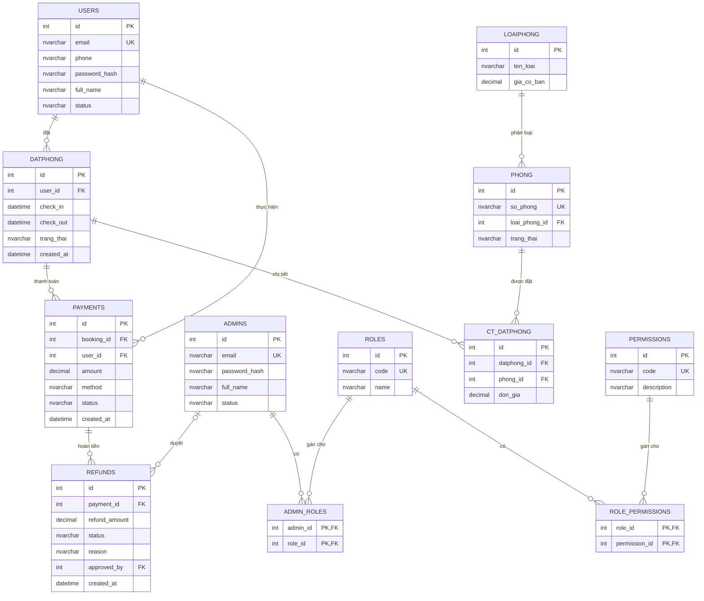

# ERD — Hệ thống Quản lý Đặt phòng

Sơ đồ quan hệ thực thể được suy ra từ [`init_tables.sql`](./init_tables.sql) và dữ liệu mẫu [`seed_data.sql`](./seed_data.sql) (MSSQL).

## 1. Tổng quan

Hệ thống gồm 3 nhóm:

| Nhóm | Bảng |
|------|------|
| User & Auth | `ADMINS`, `ROLES`, `PERMISSIONS`, `ADMIN_ROLES`, `ROLE_PERMISSIONS`, `USERS` |
| Room & Booking | `LOAIPHONG`, `PHONG`, `DATPHONG`, `CT_DATPHONG` |
| Payment | `PAYMENTS`, `REFUNDS` |

## 2. Quan hệ (cardinality)

| Quan hệ | Cardinality | Ghi chú |
|---------|-------------|---------|
| `ADMINS` ↔ `ROLES` | N:N | Qua `ADMIN_ROLES` (`PRIMARY KEY (admin_id, role_id)`) |
| `ROLES` ↔ `PERMISSIONS` | N:N | Qua `ROLE_PERMISSIONS` (`PRIMARY KEY (role_id, permission_id)`) |
| `LOAIPHONG` → `PHONG` | 1:N | `PHONG.loai_phong_id` NOT NULL |
| `USERS` → `DATPHONG` | 1:N | `DATPHONG.user_id` NOT NULL |
| `DATPHONG` ↔ `PHONG` | N:N | Qua `CT_DATPHONG`; unique `(datphong_id, phong_id)` — một phòng chỉ xuất hiện một lần trong một đơn |
| `DATPHONG` → `PAYMENTS` | 1:N | `PAYMENTS.booking_id` NOT NULL |
| `USERS` → `PAYMENTS` | 1:N | `PAYMENTS.user_id` NOT NULL |
| `PAYMENTS` → `REFUNDS` | 1:N | `REFUNDS.payment_id` NOT NULL |
| `ADMINS` → `REFUNDS` | 1:N (tùy chọn) | `REFUNDS.approved_by` nullable |

## 3. Chi tiết thực thể

### 3.1. User & Auth

**`ADMINS`** — tài khoản quản trị.

| Cột | Kiểu | Ràng buộc |
|-----|------|-----------|
| `id` | `INT IDENTITY` | PK |
| `email` | `NVARCHAR(255)` | NOT NULL, UNIQUE |
| `password_hash` | `NVARCHAR(255)` | NOT NULL |
| `full_name` | `NVARCHAR(255)` | |
| `status` | `NVARCHAR(50)` | DEFAULT `'ACTIVE'` |

**`ROLES`** — vai trò (ví dụ `SUPER_ADMIN`, `STAFF`).

| Cột | Kiểu | Ràng buộc |
|-----|------|-----------|
| `id` | `INT IDENTITY` | PK |
| `code` | `NVARCHAR(50)` | NOT NULL, UNIQUE |
| `name` | `NVARCHAR(255)` | NOT NULL |

**`PERMISSIONS`** — quyền chức năng (`MANAGE_ROOM`, `MANAGE_BOOKING`, `MANAGE_PAYMENT`, `APPROVE_REFUND`).

| Cột | Kiểu | Ràng buộc |
|-----|------|-----------|
| `id` | `INT IDENTITY` | PK |
| `code` | `NVARCHAR(100)` | NOT NULL, UNIQUE |
| `description` | `NVARCHAR(255)` | |

**`ADMIN_ROLES`** — bảng trung gian admin ↔ role.

**`ROLE_PERMISSIONS`** — bảng trung gian role ↔ permission.

**`USERS`** — khách hàng đặt phòng.

| Cột | Kiểu | Ràng buộc |
|-----|------|-----------|
| `id` | `INT IDENTITY` | PK |
| `email` | `NVARCHAR(255)` | NOT NULL, UNIQUE |
| `phone` | `NVARCHAR(20)` | |
| `password_hash` | `NVARCHAR(255)` | NOT NULL |
| `full_name` | `NVARCHAR(255)` | |
| `status` | `NVARCHAR(50)` | DEFAULT `'ACTIVE'` |

`USERS` và `ADMINS` là hai thực thể độc lập (không kế thừa / không FK lẫn nhau).

### 3.2. Room & Booking

**`LOAIPHONG`** — loại phòng và giá cơ bản.

| Cột | Kiểu | Ràng buộc |
|-----|------|-----------|
| `id` | `INT IDENTITY` | PK |
| `ten_loai` | `NVARCHAR(100)` | NOT NULL |
| `gia_co_ban` | `DECIMAL(18,2)` | NOT NULL |

**`PHONG`** — phòng vật lý.

| Cột | Kiểu | Ràng buộc |
|-----|------|-----------|
| `id` | `INT IDENTITY` | PK |
| `so_phong` | `NVARCHAR(20)` | NOT NULL, UNIQUE |
| `loai_phong_id` | `INT` | FK → `LOAIPHONG.id`, NOT NULL |
| `trang_thai` | `NVARCHAR(50)` | DEFAULT `'AVAILABLE'` |

**`DATPHONG`** — đơn đặt phòng (header).

| Cột | Kiểu | Ràng buộc |
|-----|------|-----------|
| `id` | `INT IDENTITY` | PK |
| `user_id` | `INT` | FK → `USERS.id`, NOT NULL |
| `check_in` | `DATETIME` | NOT NULL |
| `check_out` | `DATETIME` | NOT NULL |
| `trang_thai` | `NVARCHAR(50)` | DEFAULT `'PENDING'` |
| `created_at` | `DATETIME` | DEFAULT `GETDATE()` |

**`CT_DATPHONG`** — chi tiết đơn: phòng nào, đơn giá lúc đặt.

| Cột | Kiểu | Ràng buộc |
|-----|------|-----------|
| `id` | `INT IDENTITY` | PK |
| `datphong_id` | `INT` | FK → `DATPHONG.id`, NOT NULL |
| `phong_id` | `INT` | FK → `PHONG.id`, NOT NULL |
| `don_gia` | `DECIMAL(18,2)` | NOT NULL |

`CONSTRAINT UQ_CT_DATPHONG UNIQUE (datphong_id, phong_id)`.

### 3.3. Payment

**`PAYMENTS`** — thanh toán gắn với một đơn đặt phòng.

| Cột | Kiểu | Ràng buộc |
|-----|------|-----------|
| `id` | `INT IDENTITY` | PK |
| `booking_id` | `INT` | FK → `DATPHONG.id`, NOT NULL |
| `user_id` | `INT` | FK → `USERS.id`, NOT NULL |
| `amount` | `DECIMAL(18,2)` | NOT NULL |
| `method` | `NVARCHAR(50)` | ví dụ `'BANKING'` |
| `status` | `NVARCHAR(50)` | ví dụ `'PAID'` |
| `created_at` | `DATETIME` | DEFAULT `GETDATE()` |

**`REFUNDS`** — hoàn tiền từ một payment, có thể được admin duyệt.

| Cột | Kiểu | Ràng buộc |
|-----|------|-----------|
| `id` | `INT IDENTITY` | PK |
| `payment_id` | `INT` | FK → `PAYMENTS.id`, NOT NULL |
| `refund_amount` | `DECIMAL(18,2)` | NOT NULL |
| `status` | `NVARCHAR(50)` | ví dụ `'APPROVED'` |
| `reason` | `NVARCHAR(255)` | |
| `approved_by` | `INT` | FK → `ADMINS.id`, nullable |
| `created_at` | `DATETIME` | DEFAULT `GETDATE()` |

## 4. Giá trị trạng thái (từ seed)

| Bảng / cột | Giá trị xuất hiện |
|------------|-------------------|
| `ADMINS.status`, `USERS.status` | `ACTIVE` |
| `PHONG.trang_thai` | `AVAILABLE` |
| `DATPHONG.trang_thai` | `PENDING` (default schema), `CONFIRMED` (seed) |
| `PAYMENTS.method` | `BANKING` |
| `PAYMENTS.status` | `PAID` |
| `REFUNDS.status` | `APPROVED` |
